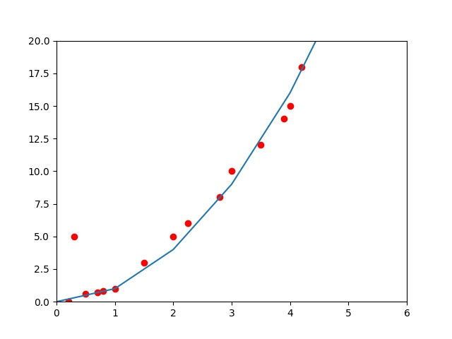

# Linear-Regression
In this folder you can find the implimentation of linear regression written in numpy with some theory explanation and mathematical background connected to this subject and some intuitions related to it. It's is the most basic problems in machine learning. According to some data and target points, we are creating a line with which we are going to predict new values.

## The Task

Imagine a dataset with the data about the size of a house and its price 

| Size of house (`x`) | Price (`y`) |
| ------------------- | ----------- |
| 20                  | 100         |
| 30                  | 150         |
| 40                  | 180         |

Given this data can we predict the the price for a new sized house?

| Size of house (`x`) | Price (`y`) |
| ------------------- | ----------- |
| 140                 | ?           |
| 10                  | ?           |

More mathematically speaking we need to find a line that can minimize the distance from every data point and the line

